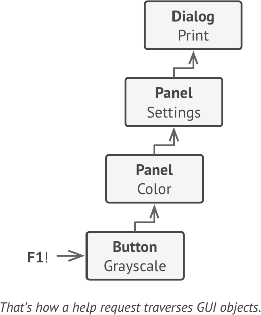

# **Chan Of Responsibility**
lets you pass requests along a chain of handlers. Upon receiving a request, each handler decides either to process the request or to pass it to the next handler in the chain.

## Applicability
- when your program is expected to process different kinds of requests in various
ways, but the exact types of requests and their sequences are unknown beforehand.
- when it’s essential to execute several handlers in a particular order.
- when the set of handlers and their order are supposed to change at runtime

## Example
-  java.util.logging.logger
-  javax.servlet.filter

**sample UML**

## Pros and Cons
✔ can control the order of request handling

✔ Single Responsibility Principle

✔ Open/Closed Principle

✘ Some requests may end up unhandled

## Relations with Other Patterns
- Command
- Mediator
- Observer
- Composite
- Commands
- Decorator

