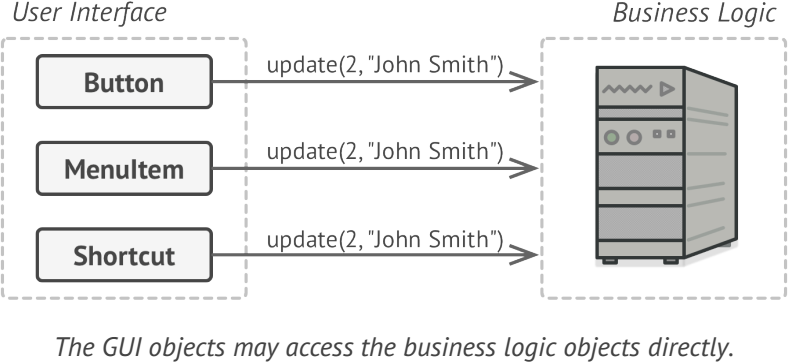
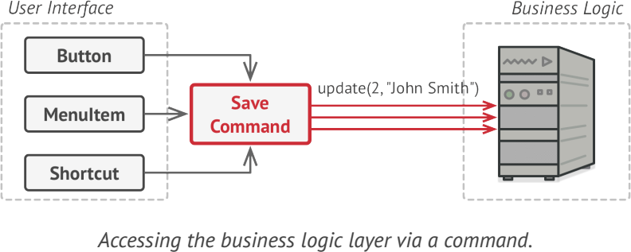
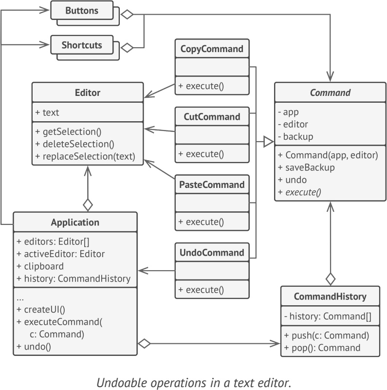

# **Command**
turns a request into a stand-alone object that contains all information about the request. This transformation lets you parameterize methods with different requests, delay or queue a request’s execution, and support undoable operations

## Applicability
- when you want to parametrize objects with operations
- when you want to queue operations, schedule their execution, or execute them remotely
- when you want to implement reversible operations

## Example
- java.lang.Runnable
- java.swing.Action

**sample UML**
    
    

## Pros and Cons
✔ Single Responsibility Principle

✔ Open/Closed Principle

✔ You can implement undo/redo

✔ You can implement deferred execution of operations

✔ You can assemble a set of simple commands into a complex one

✘ The code may become more complicated since you’re introducing a whole new layer between senders and receivers

## Relations with Other Patterns
- Chain of Responsibility, Command, Mediator and Observer address various ways of connecting senders and receivers of requests
- Handlers in Chain of Responsibility can be implemented as Commands
- You can use Command and Memento together when implementing “undo”.
- Command and Strategy may look similar because you can use both to parameterize an object with some action.
- Prototype can help when you need to save copies of Commands into history
- You can treat Visitor as a powerful version of the Command pattern. Its objects can execute operations over various objects of different classes

