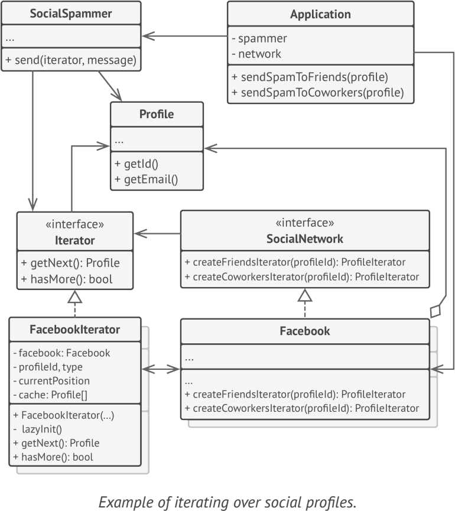

# **Iterator**
lets you traverse elements of a collection without exposing its underlying representation (list, stack, tree, etc.)

## Applicability
- when your collection has a complex data structure under the hood, but you want to hide its complexity from clients 
- to reduce duplication of the traversal code across your app
- when you want your code to be able to traverse different data structures or when types of these structures are unknown beforehand
- 

## Example
- Java’s collection
- java.util.Iterator
- java.util.enumeration
- java.util.Scanner 

**sample UML**

## Pros and Cons
✔ Single Responsibility Principle

✔ Open/Closed Principle

✔ You can iterate over the same collection in parallel b ecause each iterator object contains its own iteration state.

✔ you can delay an iteration and continue it when needed

✘ Applying the pattern can be an overkill if your app only works with simple collections.

✘ Using an iterator may be less efficient than going through elements of some specialized collections directly.

## Relations with Other Patterns
- You can use Iterators to traverse Composite trees
- ou can use Factory Method along with Iterator to let collection subclasses return different types of iterators that are compatible with the collections
- You can use Memento along with Iterator to capture the current iteration state and roll it back if necessary
- You can use Visitor along with Iterator to traverse a complex data structure and execute some operation over its elements, even if they all have different classes.

