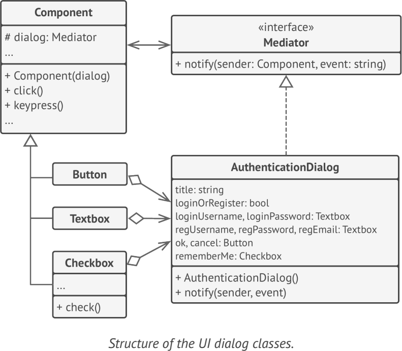

# **Mediator**
lets you reduce chaotic dependencies between objects. The pattern restricts direct communications between the objects and forces them to collaborate only via a mediator object

## Applicability
- when it’s hard to change some of the classes because they are tightly coupled to a bunch of other classes
- when you can’t reuse a component in a different program because it’s too dependent on other components
- when you find yourself creating tons of component subclasses just to reuse some basic behavior in various contexts

## Example
- java.util.concurrent.Executor
- javax.swing.ButtonGroup
- java.util.Timer

**sample UML**

## Pros and Cons
✔ Single Responsibility Principle

✔ Open/Closed Principle

✔ reduce coupling between various components

✔ reuse individual components more easily

✘ Over time a mediator can evolve into a God Object

## Relations with Other Patterns
- Chain of Responsibility, Command, Mediator and Observer address various ways of connecting senders and receivers of requests
- Facade and Mediator have similar jobs
- The difference between Mediator and Observer is often elusive. In most cases, you can implement either of these patterns; but sometimes you can apply both simultaneously

