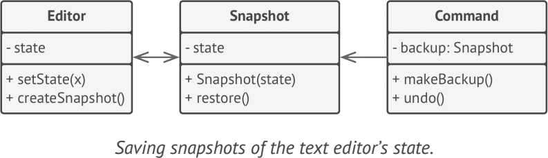

# **Memento**
lets you save and restore the previous state of an object without revealing the details of its implementation

## Applicability
- when you want to produce snapshots of the object’s state to be able to restore a previous state of the object
- when direct access to the object’s fields/getters/setters violates its encapsulation

## Example
- JTextField class in javax.swing.text.JTextComponent 
- UndoableEdit can act like a memento, and an implementation of javax.swing.text.Document can act like an originator
- java.io.Serializable 

**sample UML**

## Pros and Cons
✔ produce snapshots of the object’s state without violating its encapsulation

✔ simplify the originator’s code by letting the caretaker maintain the history of the originator’s state

✘ consume lots of RAM

✘ Caretakers should track the originator’s lifecycle to be able to destroy obsolete mementos

✘ Most dynamic programming languages, such as PHP, Python and JavaScript, can’t guarantee that the state within the memento stays untouched

## Relations with Other Patterns
- You can use Command and Memento together when implementing “undo”. 
- You can use Memento along with Iterator to capture the current iteration state and roll it back if necessary
- Sometimes Prototype can be a simpler alternative to Memento.

