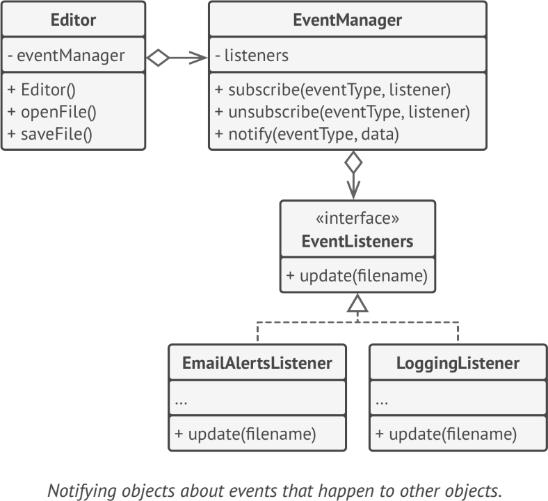

# **Observer**
lets you define a subscription mechanism to notify multiple objects about any events that happen to the object they’re observing

## Applicability
- when changes to the state of one object may require changing other objects
- when some objects in your app must observe others, but only for a limited time or in specific cases

## Example
- event-driven software
- reactive programming

**sample UML**

## Pros and Cons
✔ Open/Closed Principle. 

✔ You can establish relations between objects at runtime

✘ Subscribers are notified in random order

## Relations with Other Patterns
- Chain of Responsibility, Command, Mediator and Observer address various ways of connecting senders and receivers of requests
- The difference between Mediator and Observer is often elusive. In most cases, you can implement either of these patterns; but sometimes you can apply both simultaneously

