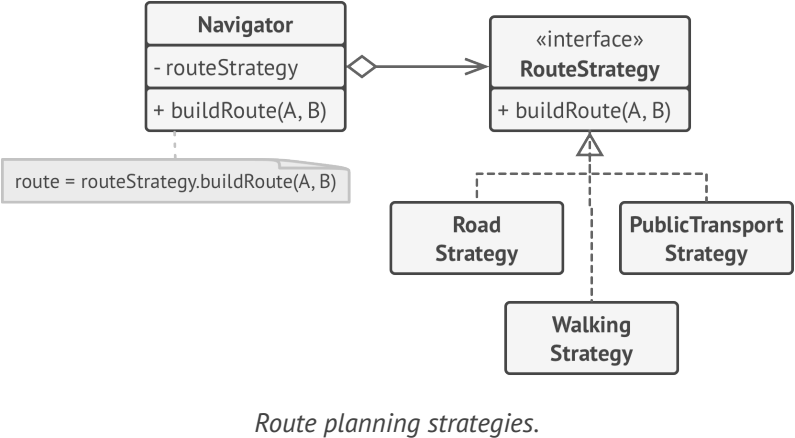

# **Strategy (Policy)**
lets you define a family of algorithms, put each of them into a separate class, and make their objects interchangeable

## Applicability
- when you want to use different variants of an algorithm within an object and be able to switch from one algorithm to another during runtime
- when you have a lot of similar classes that only differ in the way they execute some behavior
- when your class has a massive conditional operator that switches between different variants of the same algorithm
  
## Example
-  java.util.Comparator

**sample UML**

## Pros and Cons
✔ You can swap algorithms used inside an object at runtime

✔ You can isolate the implementation details of an algorithm from the code that uses it

✔ replace inheritance with composition

✔ Open/Closed Principle

✘ complicated for a couple of algorithms that rarely change

✘ Clients must be aware of the differences between strategies to be able to select a proper one

✘ anonymous functions in functional programming are better alternatives to strategy

## Relations with Other Patterns
- Bridge, State, Strategy (and to some degree Adapter) have very similar structures
- Command and Strategy may look similar because you can use both to parameterize an object with some action
- Decorator lets you change the skin of an object, while Strategy lets you change the guts
- Template Method is based on inheritance: it lets you alter parts of an algorithm by extending those parts in subclasses. Strategy is based on composition
- State can be considered as an extension of Strategy.

