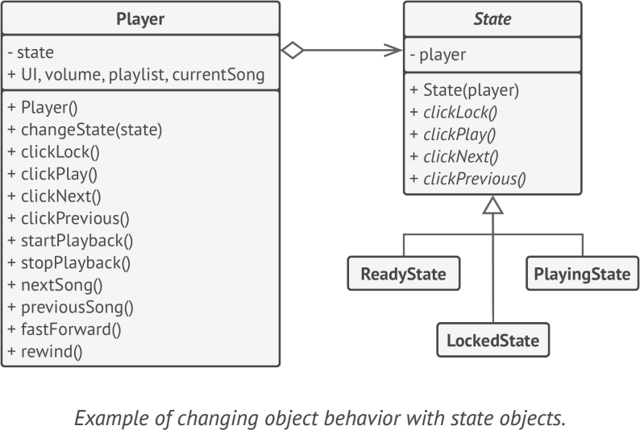

# **State**
lets an object alter its behavior when its internal state changes. It appears as if the object changed its class

## Applicability
- when you have an object that behaves differently depending on its current state
- when you have a lot of duplicate code across similar states and transitions of a condition-based state machine

## Example
- javax.faces.lifecycle 

**sample UML**

## Pros and Cons
✔ Single Responsibility Principle

✔ Open/Closed Principle

✔ Simplify the code of the context by eliminating bulky state machine conditionals

✘ Applying the pattern can be overkill if a state machine has only a few states or rarely changes.

## Relations with Other Patterns
- Bridge, State, Strategy (and to some degree Adapter) have very similar structures
- State can be considered as an extension of Strategy

