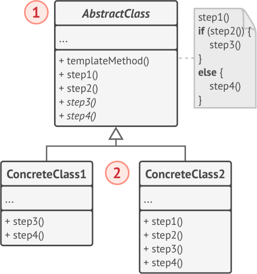
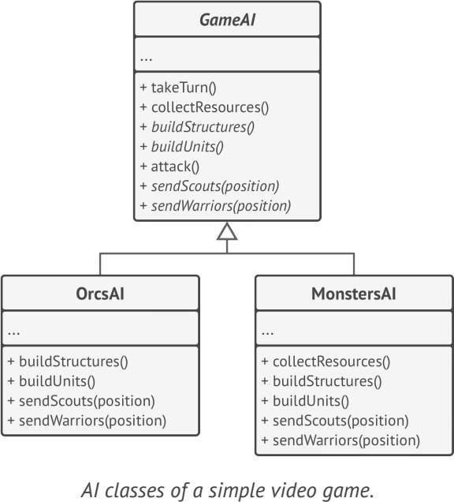

# **Template Method**
design pattern that defines the skeleton of an algorithm in the superclass but lets subclasses override specific steps of the algorithm without changing its structure.

## Applicability
- when you want to let clients extend only particular steps of an algorithm
- when you have several classes that contain almost identical algorithms with some minor differences

## Example
- java.util.AbstractSet

**sample UML**

   

## Pros and Cons
✔ You can let clients override only certain parts of a large algorithm

✔ You can pull the duplicate code into a superclass

✘ Some clients may be limited by the provided skeleton of an algorithm

✘ might violate the Liskov Substitution Principle by suppressing a default step implementation via a subclass

✘ harder to maintain

## Relations with Other Patterns
- Factory Method is a specialization of Template Method
- Template Method is based on inheritance
- 

