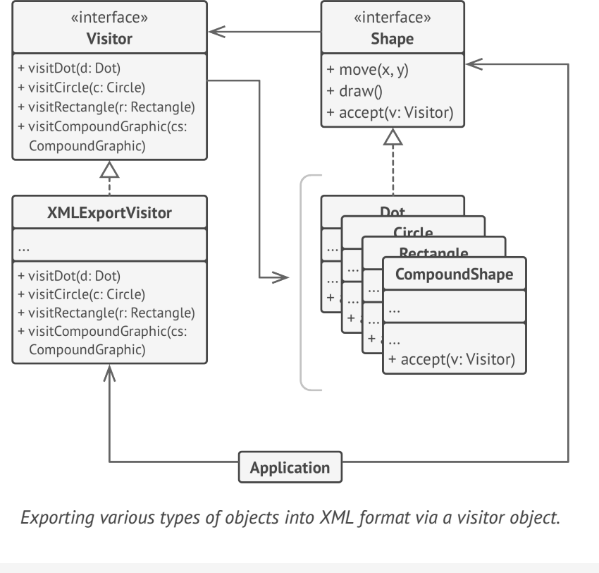

# **Visitor**
lets you separate algorithms from the objects on which they operate

## Applicability
- when you need to perform an operation on all elements of a complex object structure (for example, an object tree)
- Use the Visitor to clean up the business logic of auxiliary behaviors
- when a behavior makes sense only in some classes of a class hierarchy, but not in others

## Example
- javax.lang.model.element.ElementVisitor<R,P> (where R is the return type of visitor’s method and P is the type of additional parameter to the visitor’s method) 

**sample UML**

## Pros and Cons
✔ Open/Closed Principle

✔ Single Responsibility Principle

✘ You need to update all visitors each time a class gets added to or removed from the element hierarchy.

✘ Visitors might lack the necessary access to the private fields and methods of the elements that they’re supposed to work with

## Relations with Other Patterns
- .

