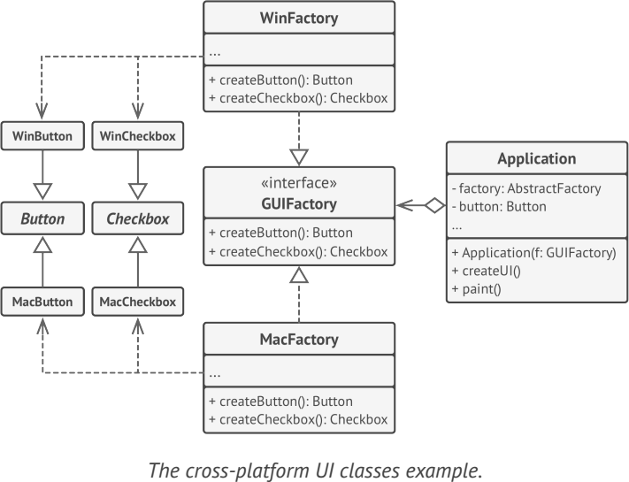

# **Abstract Factory**
lets you produce families of related objects without specifying their concrete classes

## Applicability
Use the Abstract Factory when your code needs to work with various families of related products, but you don’t want it to
depend on the concrete classes of those products—they might be unknown beforehand or you simply want to allow for future extensibility

## Example
- javax.xml.parsers.DocumentBuilderFactory
- javax.xml.transform.TransformerFactory

**Sample UML**

## Pros and Cons
✔ products from a factory are compatible 

✔ avoid tight coupling

✔ Single Responsibility Principle

✔ Open/Closed Principle

✘ The code may become more complicated since you need to introduce a lot of new subclasses

## Relations with Other Patterns
- Factory
- Prototype
- Builder

