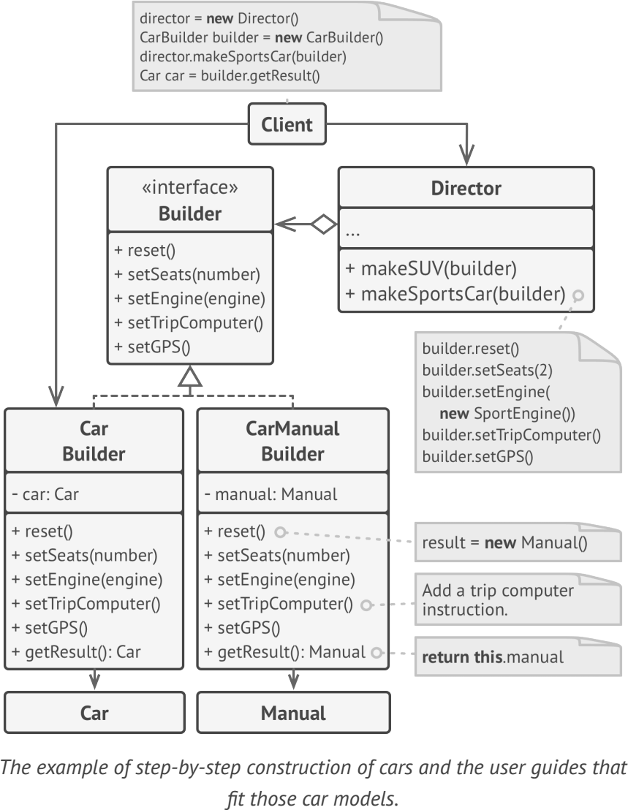

# **Builder**
construct complex objects step by step

## Applicability
- Use the Builder pattern to get rid of a “telescopic constructor”.
- Use the Builder pattern when you want your code to be able to create different representations of some product (for example, stone and wooden houses)
- Use the Builder to construct Composite trees or other complex objects

## Example
- convert one text format to another text format (e.g., RTF to ASCII text).
- Java.util.Calendar.Builder
- java.lang.StringBuilder 

**sample UML**

## Pros and Cons
✔ construct objects step-by-step

✔ reuse the same construction code when building various representations of products

✔ Single Responsibility Principle

✘ complexity increases new classes

## Relations with Other Patterns
- Factory
- Abstract Factory
- Prototype
- Bridge
- Abstract Factories, Builders and Prototypes can all be implemented as Singletons

