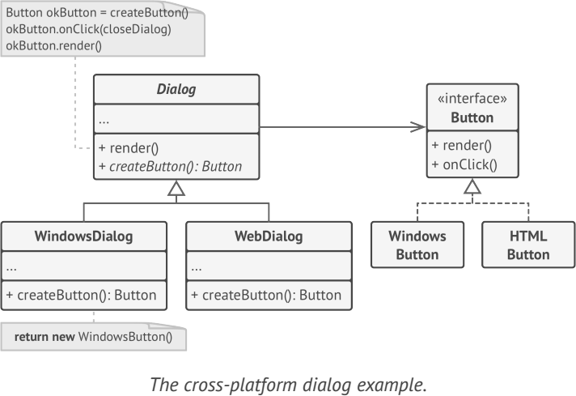

# **Factory**
is a creational design pattern that provides an interface for creating objects in a superclass, but allows subclasses to alter the type of objects that will be created.

## Applicability
- Use the Factory Method when you don’t know beforehand the exact types and dependencies of the objects your code should work with
- Use the Factory Method when you want to provide users of your library or framework with a way to extend its internal components
- Use the Factory Method when you want to save system resources by reusing existing objects instead of rebuilding them each time

## Example
- application that needs to support two different databases
- java.text.NumberFormat
- java.net.URLStreamHandlerFactory 

**Sample UML**

## Pros and Cons
✔ avoid tight coupling between the creator and the concrete products

✔ Single Responsibility Principle. You can move the product creation code into one place in the program

✔ Open/Closed Principle. You can introduce new types of products into the program without breaking existing client code

✘ The code may become more complicated since you need to introduce a lot of new subclasses

## Relations with Other Patterns
- Abstract Factory
- Prototype
- Builder

