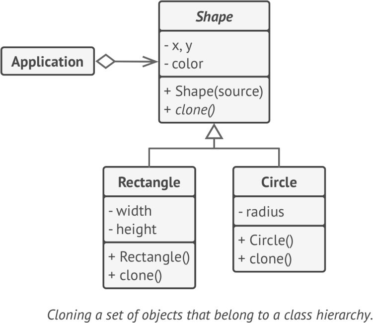

# **Prototype**
lets you copy existing objects without making your code dependent on their classes

## Applicability
- Use the Prototype pattern when your code shouldn’t depend on the concrete classes of objects that you need to copy
- The Prototype pattern lets you use a set of pre-built objects, configured in various ways, as prototypes

## Example
- Object.clone()
- copy of your original application, make changes, and analyze further. Surely, to save your time and money, you do not want to start from scratch

**sample UML**

## Pros and Cons
✔ clone objects without coupling to their concrete classes

✔ get rid of repeated initialization code 

✔ alternative to inheritance when dealing with configuration presets for complex objects

✘ Cloning complex objects that have circular references might be very tricky

## Relations with Other Patterns
- Abstract Factory
- Factory
- Builder
- Prototype can help when you need to save copies of Commands into history
- Designs that make heavy use of Composite and Decorator can often benefit from using Prototype. Applying the pattern lets 
    you clone complex structures instead of re-constructing them from scratch
- Sometimes Prototype can be a simpler alternative to Memento
- Abstract Factories, Builders and Prototypes can all be implemented as Singletons.
