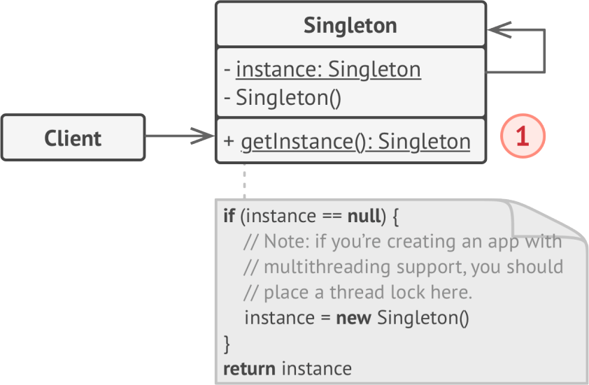

# Singleton
solves two problems at the same time
1. Ensure that a class has just a single instance
1. Provide a global access point to that instance

## Applicability
- when a class in your program should have just a single instance available to all clients; for example, a single database object
- when you need stricter control over global variables

## Example
- OS file system
- java.lang.Runtime

**sample UML**

## Pros and Cons
✔ Ensure a class has only a single instance

✔ global access point to that instance

✔ initialized only for the first time

✘ Violates Single Responsibility Principle

✘  requires special treatment in a multithreaded environment

✘  difficult to unit test the client code 

## Relations with Other Patterns
- Facade
- Flyweight
- Abstract Factories
- Builders
- Prototype
