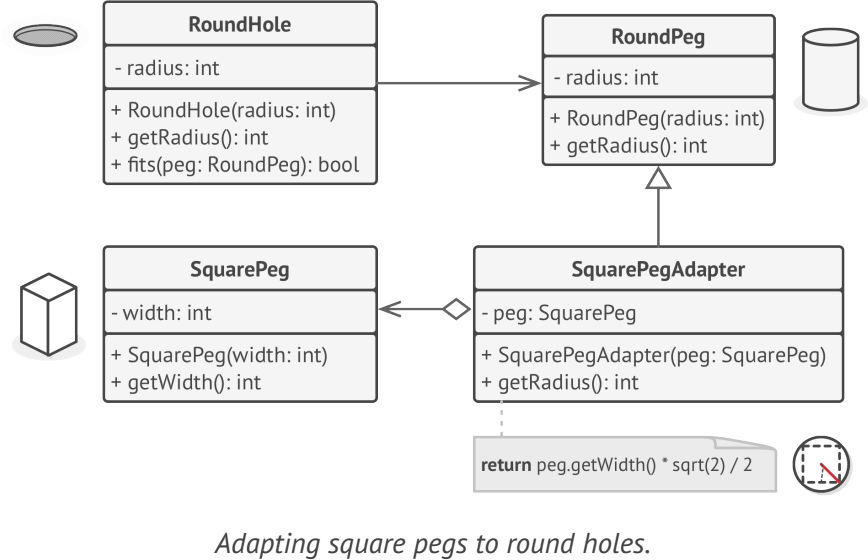

# **Adapter**
allows objects with incompatible interfaces to collaborate

## Applicability
- when you want to use some existing class, but its interface isn’t compatible with the rest of your code
- when you want to reuse several existing subclasses that lack some common functionality that can’t be added to the superclass

## Example
- java.io.InputStreamreader
- java.io.OutputStreamWriter
they adapt an existing InputStream/OutputStream object to a reader/Writer interface. 

**sample UML**

## Pros and Cons
✔ Single Responsibility Principle

✔ Open/Closed Principle

✘ Overall complexity of the code increases because you need to introduce a set of new interfaces and classes

## Relations with Other Patterns
- Bridge
- Decorator
- Proxy
- Facade
- Bridge, State, Strategy (and to some degree Adapter) have very similar structures.

