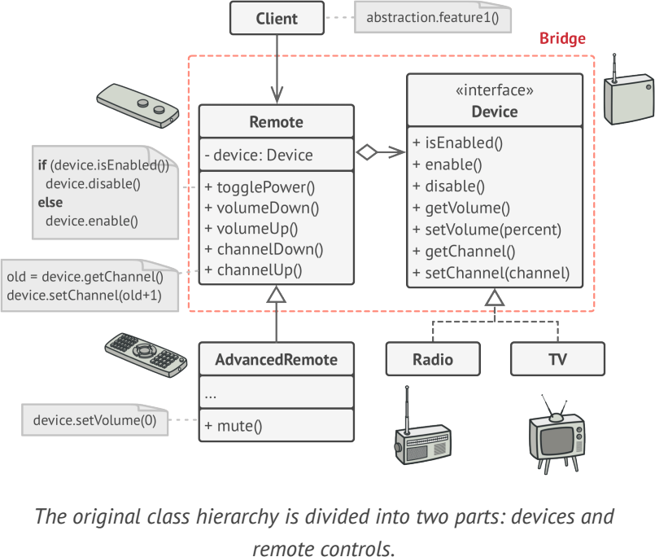

# **Bridge**
lets you split a large class or a set of closely related classes into two separate hierarchies—abstraction and implementation—which can be developed independently of each other.

## Applicability
- when you want to divide and organize a monolithic class that has several variants of some functionality 
- when you need to extend a class in several orthogonal (independent) dimensions
- if you need to be able to switch implementations at runtime

## Example
- JDBC: bridge between your application and a particular database
- java.sql.DriverManager and java.sql.Driver
- com.mysql.jdbc.Driver and jdbc.driver.OracleDriver

**sample UML**

## Pros and Cons
✔ platform-independent classes and apps

✔ The client code works with high-level abstractions. It isn’t exposed to the platform details.

✔ Open/Closed Principle

✔ Single Responsibility Principle

✘ You might make the code more complicated by applying the pattern to a highly cohesive class.

## Relations with Other Patterns
- Adapter 
- Bridge, State, Strategy (and to some degree Adapter) have very similar structures. 
- Abstract Factory
- Builder

