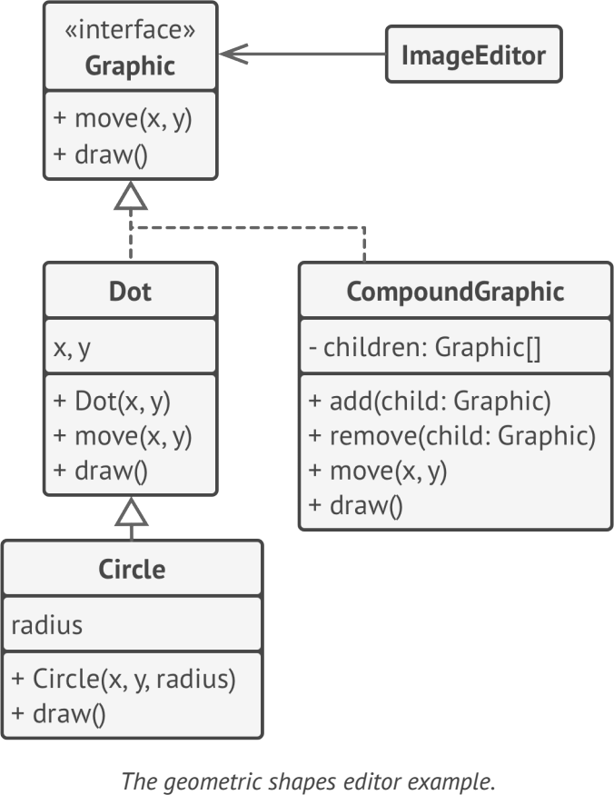

# **Composite**
lets you compose objects into tree structures and then work with these structures as if they were individual objects

## Applicability
- when you have to implement a tree-like object structure
- when you want the client code to treat both simple and complex elements uniformly
- 

## Example
- UI frameworks (like Abstract Window Toolkit (AWT) )
- java.awt.Container 

**sample UML**

## Pros and Cons
✔ work with complex tree structures more conveniently

✔ Open/Closed Principle

✘ It might be difficult to provide a common interface for classes whose functionality differs too much

## Relations with Other Patterns
- Builder
- Chain of Responsibility 
- Iterators
- Visitor 
- Flyweights
- Decorator

