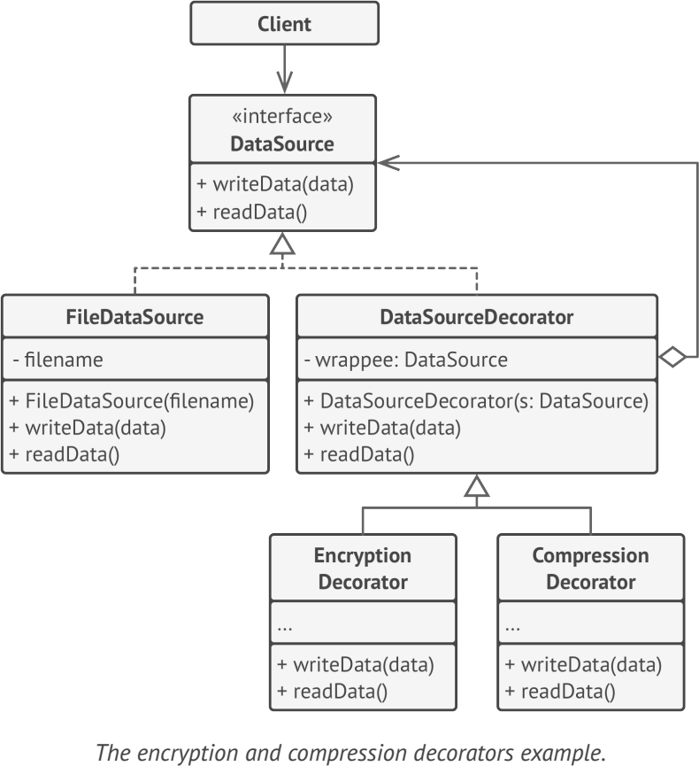

# **Decorator**
lets you attach new behaviors to objects by placing these objects inside special wrapper objects that contain the behaviors

## Applicability
- when you need to be able to assign extra behaviors to objects at runtime without breaking the code that uses these objects
- when it’s awkward or not possible to extend an object’s behavior using inheritance
- 

## Example
-  java.io.BufferedoutputStream class can decorate any java.io.outputStream object

**sample UML**

## Pros and Cons
✔ extend an object’s behavior without making a new subclass.

✔ add or remove responsibilities from an object at runtime

✔ combine several behaviors by wrapping an object into multiple decorators

✔ Single Responsibility Principle

✘ hard to remove a specific wrapper from the wrappers stack.

✘ hard to implement a decorator in such a way that its behavior doesn’t depend on the order in the decorators stack.

✘ initial configuration code of layers might look pretty ugly.

## Relations with Other Patterns
- Adapter
- Proxy
- Chain of Responsibility
- Composite
- Prototype
- Strategy

