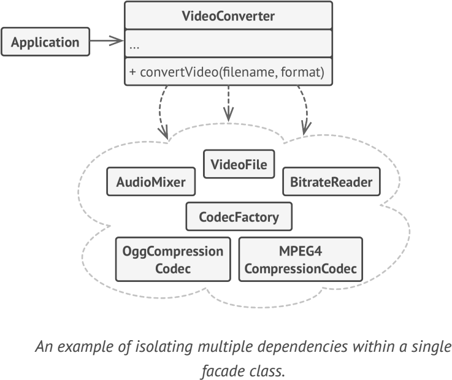

# **Facade**
provides a simplified interface to a library, a framework, or any other complex set of classes.

## Applicability
- when you need to have a limited but straightforward interface to a complex subsystem
- when you want to structure a subsystem into layers

## Example
-  java.net.URL
-  JDBC

**sample UML**

## Pros and Cons
✔ isolate your code from the complexity of a subsystem

✘ A facade can become a god object coupled to all classes of an app

## Relations with Other Patterns
- Adapter 
- Abstract Factory
- Flyweight
- Mediator 
- Singleton
- Proxy 

