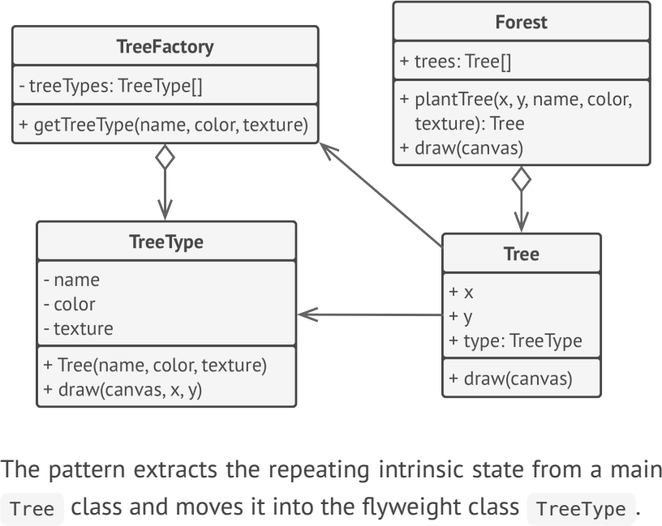

# **Flyweight**
lets you fit more objects into the available amount of RAM by sharing common parts of state between multiple objects instead of keeping all of the data in each object

## Applicability
- when your program must support a huge number of objects which barely fit into available RAM.
- 

## Example
-  in Java, when using the wrapper classes, such as java.lang.integer, java.lang.Short, java.lang.Byte, and java.lang.Character
-  String pool

**sample UML**

## Pros and Cons
✔ save lots of RAM

✘ trading RAM over CPU cycles
✘ code becomes much more complicated

## Relations with Other Patterns
- Composite
- Facade
- Singleton

