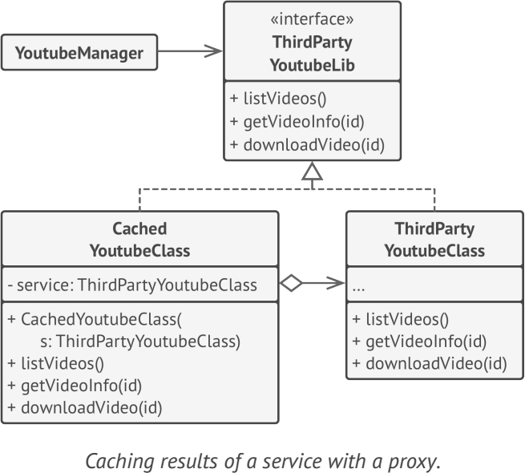

# **Proxy**
lets you provide a substitute or placeholder for another object. A proxy controls access to the original object, allowing you to perform
something either before or after the request gets through to the original object.

## Applicability
- Lazy initialization (virtual proxy). This is when you have a heavyweight service object that wastes system resources by being always up, even though you only need it from time to time. Instead of creating the object when the app launches, you can delay the object’s initialization to a time when it’s really needed
- Local execution of a remote service (remote proxy)
- Caching request results (caching proxy)

## Example
-  java.lang.reflect
-  java.rmi.* 

**sample UML**

## Pros and Cons
✔ control the service object without clients knowing about it

✔ manage the lifecycle of the service object when clients don’t care about it

✔ The proxy works even if the service object isn’t ready or is not available

✔ Open/Closed Principle

✘ The code may become more complicated since you need to introduce a lot of new classes.

✘ The response from the service might get delayed.

## Relations with Other Patterns
- Adapter 
- Decorator
- Facade

